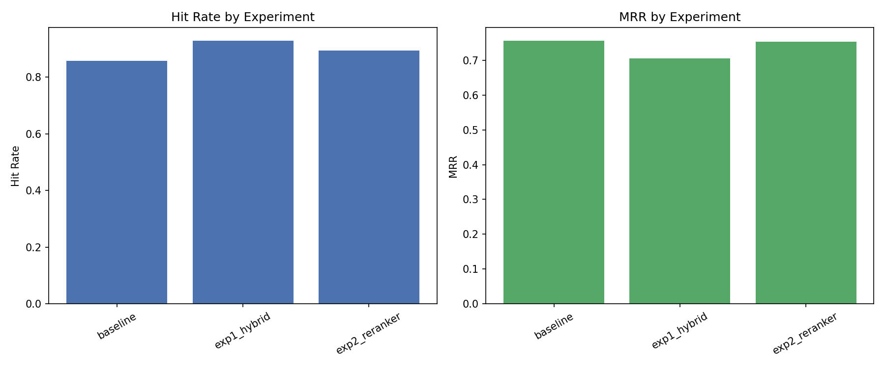

# RAG Document QA

## Project Overview
A Retrieval‑Augmented Generation (RAG) pipeline that answers questions from PDF documents.  
It ingests PDFs, creates token‑aware chunks, stores embeddings in ChromaDB, retrieves relevant chunks using dense, hybrid (BM25 + RRF) or cross‑encoder reranking, and generates a deterministic (temperature 0) answer with page‑level citations.

## Setup Instructions
1. **Clone the repository**  
   ```bash
   git clone https://github.com/yourusername/rag-document-qa.git
   cd rag-document-qa
   ```

2. **Create a virtual environment & install dependencies**  
   ```bash
   python -m venv .venv
   # Linux / macOS
   source .venv/bin/activate
   # Windows
   .venv\Scripts\activate
   pip install -r requirements.txt
   ```

3. **Configure API keys**  
   Copy `.env.example` → `.env` and fill in the keys for the LLM provider you plan to use (`LLM_PROVIDER=anthropic|openai|gemini|groq`).

## Running the Service
```bash
# start the FastAPI backend
uvicorn app.main:app --reload

# in another terminal, start the UI
streamlit run frontend/streamlit_app.py
```
Open `http://localhost:8501` to upload your PDF document directly through the UI and start asking questions!

## Evaluation
The benchmark uses `evaluation/dataset.json` (28 Q&A pairs). Run:
```bash
python -m experiments.report
```
The script prints a table with **Hit@k**, **Recall@k**, and **Mean Reciprocal Rank (MRR)** and saves a bar chart at `experiments/results/graphs/experiment_comparison.png`.

## Results
| Strategy                     | Hit Rate | MRR   | Recall |
|------------------------------|----------|-------|--------|
| Baseline (dense)             | 85.7%    | 0.756 | 82.1%  |
| Hybrid (BM25 + RRF)          | 92.9%    | 0.705 | 89.3%  |
| Cross-Encoder Reranker       | 89.3%    | 0.753 | 85.7%  |



## File Structure
```
rag-document-qa/
├─ app/
│   ├─ ingestion/
│   ├─ chunking/
│   ├─ retrieval/
│   ├─ generation/
│   ├─ config.py
│   └─ pipeline.py
├─ data/
│   ├─ raw/
│   └─ vector_db/
├─ evaluation/
├─ experiments/
│   └─ results/
│       └─ graphs/
├─ frontend/
├─ .env.example
├─ requirements.txt
└─ README.md
```
